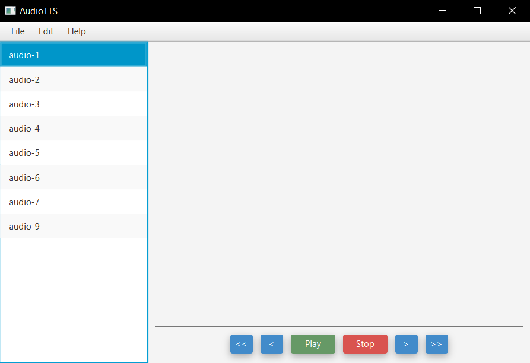

# AudioTTS
> A text to speech software utilizing Google's WaveNet technology. 



Having struggled with ADHD, I often find myself using audio books for reading, but am often unable to find them for 
textbooks. Unsatisfied with traditional TTS software, and not wanting to pay a tramendous amount for premium software,
I decided to make my own using Google's WaveNet technology.

## Getting Started

### Installing

A step by step series of examples that tell you how to get a development env running

Say what the step will be

```
Give the example
```

And repeat

```
until finished
```

End with an example of getting some data out of the system or using it for a little demo


## Created With

* [Maven](https://maven.apache.org/) - Dependency Management
* [OpenJFX](https://openjfx.io/) - GUI framework
* [Google Cloud](https://cloud.google.com/) - TTS and OCR framework
* [JFoeniX](http://www.jfoenix.com/) - GUI theming

## Authors

* **Nicolas Newman** - *Creator* - [NicolasNewman](https://github.com/NicolasNewman)

## License

This project is licensed under the MIT License - see the [LICENSE.md](LICENSE.md) file for details